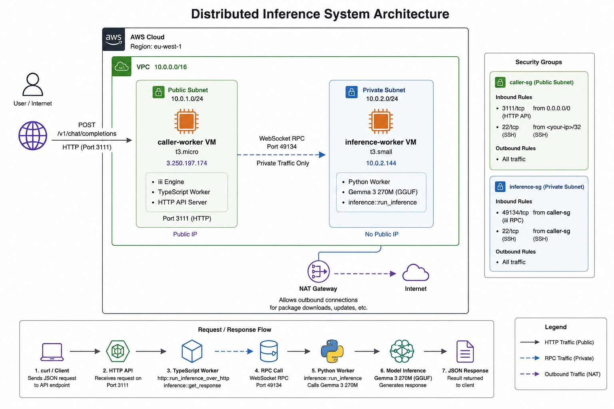

# Distributed Inference System - DevOps Internship Assignment
A distributed AI inference system deployed on AWS using private networking, RPC-based worker communication, and Infrastructure-as-Code.

## Overview

This project deploys the Alchemyst AI quickstart across two AWS EC2 VMs in a private VPC subnet. A Python worker hosts the Gemma 3 270M language model and exposes inference as an RPC function. A TypeScript worker fans HTTP requests into that RPC and returns results as JSON. The two workers run on separate machines and communicate through the `iii` engine over the private subnet — no public internet involved in the worker-to-worker path.

---

## Architecture


The architecture consists of a public API gateway VM running the TypeScript worker and iii engine, and a private inference VM running the Python inference worker hosting the Gemma 3 270M model. Communication between workers occurs over private WebSocket RPC within the VPC subnet.

### RPC Flow

```
curl → iii-http (port 3111)
     → http::run_inference_over_http  [caller-worker, TypeScript]
     → inference::get_response        [caller-worker, TypeScript]
     → inference::run_inference       [inference-worker, Python]
     → Gemma 3 270M model
     → result returned as JSON
```

---

## API Reference

### Endpoint

```
POST http://3.250.197.174:3111/v1/chat/completions
Content-Type: application/json
```

### Request Schema

```json
{
  "messages": [
    {
      "role": "user",
      "content": "Your prompt here"
    }
  ]
}
```

### Sample Request

```bash
curl -X POST http://3.250.197.174:3111/v1/chat/completions \
  -H 'Content-Type: application/json' \
  -d '{"messages": [{"role": "user", "content": "Say hello in one sentence."}]}' \
  --max-time 300
```

### Sample Response

```json
{
  "result": {
    "response": "Hello! It's great to meet you.",
    "success": "You've connected two workers and they're interoperating seamlessly."
  }
}
```

---

## Redeploy From Scratch

### Prerequisites

- AWS account with programmatic access (Access Key + Secret)
- Terraform >= 1.0 installed
- AWS CLI configured
- SSH key pair

### Step 1 — Configure AWS CLI

```bash
aws configure
# Enter your Access Key ID, Secret, region: eu-west-1, format: json
```

### Step 2 — Generate SSH Key

```bash
ssh-keygen -t ed25519 -f ~/.ssh/devops-assignment -N ""
```

### Step 3 — Provision Infrastructure

```bash
cd terraform
terraform init
terraform apply -var="your_ip=$(curl -s ifconfig.me)"
```

Note the outputs:
- `caller_public_ip` — your API endpoint and SSH target
- `inference_private_ip` — private IP of inference VM

### Step 4 — Deploy Caller VM

```bash
ssh -i ~/.ssh/devops-assignment ubuntu@<caller_public_ip>

# Run the setup script
bash <(curl -s https://raw.githubusercontent.com/YOUR_USERNAME/devops-assignment/main/scripts/setup-caller.sh)
```

### Step 5 — Deploy Inference VM

```bash
# From inside caller VM
ssh -i ~/.ssh/devops-assignment ubuntu@<inference_private_ip>

bash <(curl -s https://raw.githubusercontent.com/YOUR_USERNAME/devops-assignment/main/scripts/setup-inference.sh)
```

### Step 6 — Test

```bash
curl -X POST http://<caller_public_ip>:3111/v1/chat/completions \
  -H 'Content-Type: application/json' \
  -d '{"messages": [{"role": "user", "content": "Say hello."}]}' \
  --max-time 300
```

---

## Production Hardening

If I were to put this in production, I would address the following:

**Network Security**
- Put the API behind an Application Load Balancer with HTTPS/TLS termination. Right now HTTP traffic is unencrypted.
- Restrict port 3111 to known IP ranges rather than open to the world.
- Enable VPC Flow Logs to audit all network traffic in and out of the subnet.
- Remove the NAT Gateway after initial setup and use VPC Endpoints for S3/ECR access to reduce attack surface.

**Authentication & Authorization**
- Add an API key or JWT authentication layer in front of the HTTP endpoint so not anyone can call the inference API.
- Use AWS IAM roles on the EC2 instances instead of any hardcoded credentials.
- Store secrets (HuggingFace token, etc.) in AWS Secrets Manager, not environment variables.

**Reliability**
- Run the iii engine and both workers as systemd services so they restart automatically on crash or reboot.
- Add a health check endpoint and wire it to an ALB target group for automatic instance replacement.
- Enable CloudWatch alarms on CPU, memory, and error rates.

**Model & Data**
- Store the GGUF model file in S3 and pull it on startup rather than downloading from HuggingFace every time — faster and more reliable.
- Enable encryption at rest on all EBS volumes.

---

## If the Model Were 100x Larger

A model 100x the size of Gemma 270M (~27B parameters) would require a fundamentally different infrastructure approach:

**Compute** — A t3.small would be completely inadequate. We would need GPU instances (AWS g5 or p4d family) with at least 80GB VRAM. This changes the cost from ~$2/day to potentially $30-100+/hour.

**Model Loading** — De-quantizing a 27B model takes significant time. We would pre-load the model into a persistent process and keep it warm rather than loading on startup. Tools like vLLM or TGI (Text Generation Inference) are purpose-built for this and handle batching, KV caching, and continuous batching automatically.

**Scaling** — A single inference VM would become a bottleneck. We would put multiple inference VMs behind an internal load balancer and scale horizontally based on request queue depth using an auto-scaling group.

**Storage** — The model file itself would be 15-50GB. We would store it on EFS (shared NFS) or pull from S3 on startup, and use larger EBS volumes with provisioned IOPS.

**The iii worker architecture** would still work — we would just swap the Python inference handler to call a vLLM server over HTTP internally rather than loading the model directly in-process.

---

## Tech Stack

| Component | Technology |
|---|---|
| Cloud | AWS (eu-west-1) |
| IaC | Terraform |
| Networking | VPC, Public/Private Subnets, NAT Gateway, Security Groups |
| Compute | EC2 t3.micro (caller), EC2 t3.small (inference) |
| OS | Ubuntu 22.04 LTS |
| RPC Framework | iii (WebSocket-based) |
| Inference Worker | Python 3.11, transformers, torch |
| API Worker | TypeScript, Bun |
| Model | Gemma 3 270M GGUF (Q8 quantized) |
